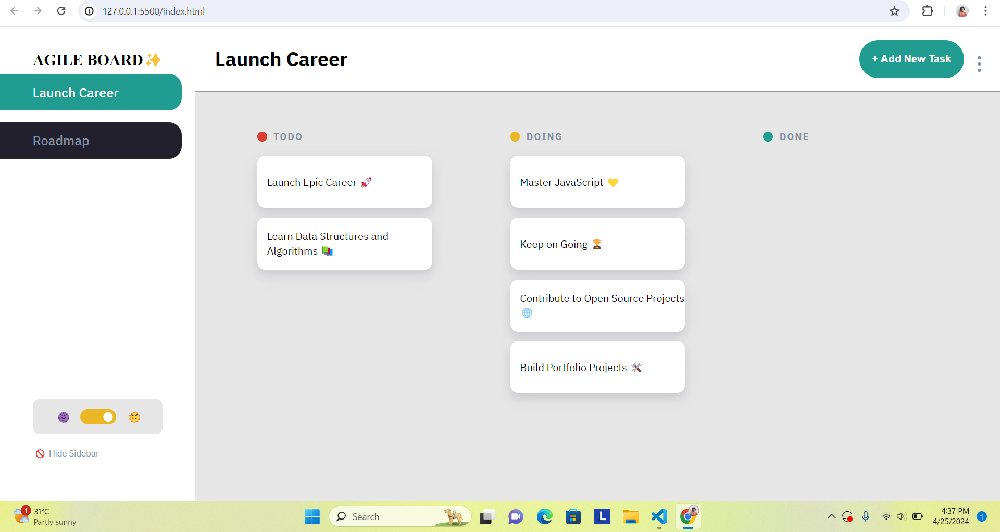

# [JSL11] Agile Board - Kanban Task Management App

## Overview

In this project, I brought a Kanban Management app to life by implementing the features described in the provided user stories.

## Walkthrough of the App (Agile Board Project Feature List)

1. When you open the App, the user can click on the `Add New Task` button and create a task with a title, description and set the status which will immediately reflect.
2. When you click on the individual task, it will show all the details. Here you can edit each task and update the task title, desciption and status and save the changes which will reflect immediately on the UI.
3. The tasks can also be deleted directly from the edits modal.
4. The user can also cancel their edits and close the modal.
5. Information can be updated by editing the existing tasks and the changes will be saved to the local storage and not be cleared when the page is refreshed.
6. The side bar can be hidden to gain more work space or opened to access different boards and the theme switch.
7. The user can also use dark mode to reduce eye strain and light mode to suite the environments with the according logo updates.

## Project outcome

## Loom Presentation Link

[Loom Presentation Link](https://www.loom.com/share/909547fca7d845aca300444231e96492?sid=9cfb91de-06ec-423d-9e0c-3534083d77b8)
